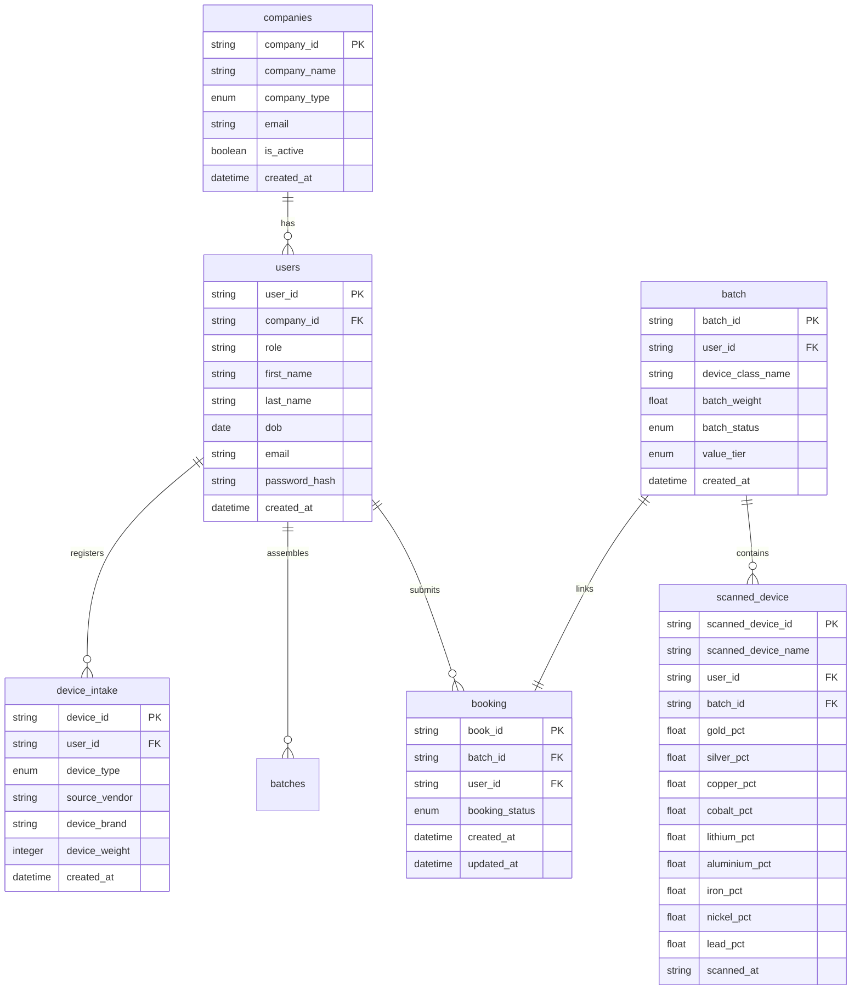

# 5.1 Entity Relationships

The E-Loop relational database model uses strict referential integrity parameters to maintain multi-tenant data boundaries, trace the physical e-waste lifecycle, and isolate commercial procurement transactions.

---

## Relationship Definition Matrix

The table below catalogs every explicit structural link, cardinality type, and business constraint rule declared across the relational storage system:

| # | From Table | To Table | Type | Operational Description |
| :---: | :--- | :--- | :--- | :--- |
| **1** | `companies` | `users` | One-to-Many | One company can have many workers registered. |
| **2** | `users` | `device_intake` | One-to-Many | One worker can register many e-waste device intakes over time. |
| **3** | `users` | `batches` | One-to-Many | One worker can create multiple analyzed batches. |
| **4** | `users` | `booking` | One-to-Many | One refinery worker can make multiple booking inquiries. |
| **5** | `batch` | `scanned_device` | One-to-Many | One batch can have many scanned device records linked to it. |
| **6** | `batch` | `booking` | One-to-One | One batch has one booking linked to it. |

---

## Entity Relationship Diagram

The diagram below outlines table structures, primary keys `(PK)`, foreign keys `(FK)`, and structural relationship cardinalities across the database ledger:

