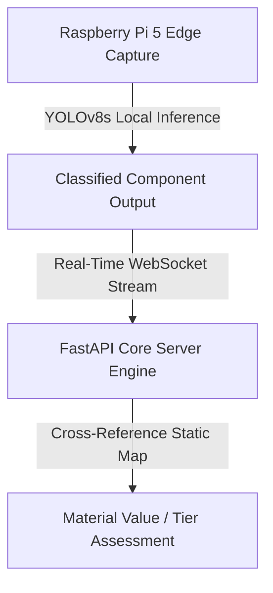

# 1.1 What Nuru Does

**Nuru** is an artificial intelligence (AI) and Internet of Things (IoT)driven electronic waste (e-waste) material intelligence system developed by **e-Loop**. The platform transforms manual sorting into an automated, data-driven framework by connecting local e-waste recycling centers with downstream industrial refinery pipelines.

## System Overview

The ecosystem operates on a multi-tier architectural blueprint designed to bridge the visibility gap between material retrieval and processing:

* **Core Backend Infrastructure:** A unified **FastAPI REST API** backed by a robust, relational **PostgreSQL database**.
* **Operator Client Platform:** A **Next.js Progressive Web App (PWA)** optimized for high-visibility intake tracking and inventory handling on the sorting floor.
* **Buyer Marketplace Client:** A native **Flutter mobile application** tailored for industrial metallurgy buyers browsing marketplace assets.

## Technical Architecture Stack

| Layer | Technology Profile | Core Operational Scope |
| :--- | :--- | :--- |
| **Edge Hardware** | Raspberry Pi 5 + Camera Module 3 | Computer vision component acquisition |
| **Edge AI Engine** | YOLOv8s Model Integration | Local classification inference processing |
| **Data Stream** | Stateful HTML5 WebSockets | Real-time edge-to-cloud classification ingestion |
| **Cloud Broker** | FastAPI Core Service Router | Value algorithms and business logic validation |

## High-Level Processing Flow

### 1. Local Edge Identification
The scanning pipeline begins on the conveyor sorting belt. A **Raspberry Pi 5** edge station leverages a **Raspberry Pi Camera Module 3** to isolate and visually recognize complex electronic components (such as printed circuit boards and lithium-ion batteries). The edge module processes the optical stream locally using a specialized **YOLOv8s machine learning model** to assign structural component markers (e.g., `smartphone_logic_board`).

### 2. Ingestion & Analysis Stream
The identified target classes are piped over a persistent backend **WebSocket** pipeline to minimize traditional HTTP structural latency. Upon receipt, the backend cloud processor intercepts the raw event metrics and cross-references the component tag against an internal material composition mapping model. The module computes localized rare-earth material ratios to establish an absolute item-level rating.

### 3. Aggregation & Marketplace Entry
When a sorting worker seals a physical lot group, the pipeline triggers an evaluation sequence:
* The system computes a **weighted composition average** from all registered items.
* The batch is locked into a categorical assessment status (**HIGH**, **MEDIUM**, or **LOW**).
* The verified batch metrics are dynamically pushed live to the platform's **Digital Showroom**.
* Authorized refinery purchasers can filter listings, review aggregated element values, and execute immediate procurement holds.
